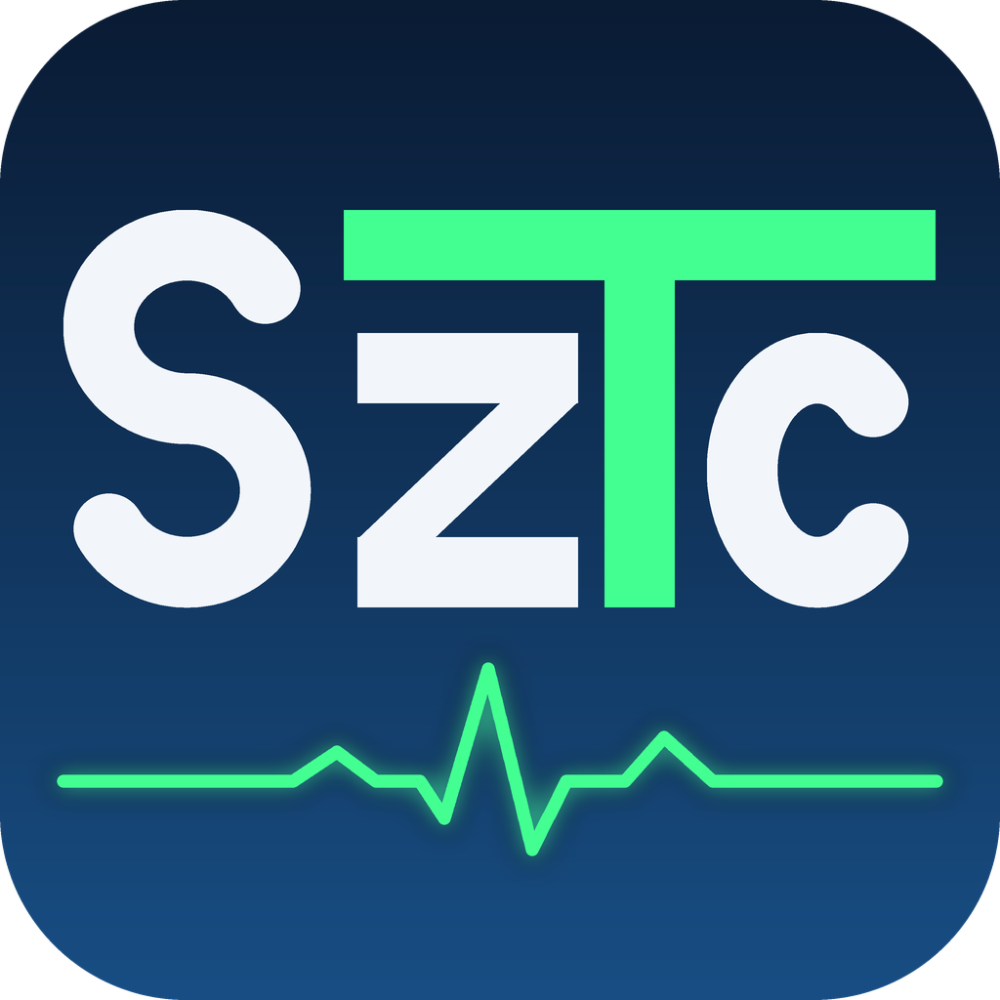

# SzTextCompar

**Text similarity and comparison analyzer for Windows** — a desktop tool that compares two documents (or a whole folder of them) using nine independent similarity methods, highlights matching passages side by side, and visualizes the result as an ECG-style waveform, charts, and an interactive report.

Written in pure Python (Tkinter), with **no third-party runtime dependency** — the source imports only the Python standard library.



---

## Features

### Two-file comparison
- Open two text/document files side by side, with synchronized scrolling and a line-number gutter.
- Nine independent analysis methods, each giving its own similarity score and a plain-language verdict:
  1. **Traditional Diff** (character/line level)
  2. **Winnowing Fingerprint** — robust to reordering and small edits
  3. **TF-IDF Weighted Content Analysis** (precise cosine similarity, rare words weighted higher)
  4. **Sentence Rhythm & Structure** — a paraphrase filter based on sentence-length patterns
  5. **N-gram Phrase Matching** (common 4-word sequences)
  6. **Vocabulary (Cosine) Similarity**
  7. **Jaccard Similarity** (set-based)
  8. **Simhash Fingerprint** (fast, language-independent)
  9. **Summary Table & Similarity Index** — a weighted overall score combining all of the above, with a table and a chart
- **Visual Match View**: highlights every matching phrase (configurable minimum word count) in both texts with a color-coded palette, with a clickable match list and next/previous navigation.
- **Detailed Visualization**: keyword, sentence-rhythm, style, common-n-gram and word-frequency charts, side by side for both texts — exportable as a single, self-contained **HTML report** (charts included as inline SVG, no external files or internet connection needed to view it).
- **Full-Screen Match Waveform ("ECG")**: an ECG-style waveform across the whole document — flat where the texts diverge, rising to a full peak for long, sentence-length exact matches. Click or drag on the waveform to jump to that point in both texts at once; zoom horizontally to inspect a section closely. The waveform can be exported as a standalone **SVG or PNG image**.
- **HTML Report**: a shareable, standalone HTML summary of the whole comparison.
- Line synchronization (align by diff blocks), timestamp removal (left/right, e.g. for subtitle files), and a "Save As" flow that always lets you choose the output format explicitly (never guesses or silently overwrites your original file).
- Save either side **with its highlight colors and underline preserved** as `.docx`, `.odt` or `.html` — or as plain text.

### Folder Matrix (batch comparison)
- Point the tool at a folder; it compares every file pair in it and shows a sortable similarity matrix.
- Optional result caching and multi-core (multiprocessing) processing for large folders.
- Double-click any pair in the matrix to open it in the two-file view.

### File formats
Kept deliberately to formats that need **no external library and no extra license**:
- **Open, read**: `.txt` (auto-detects UTF-8 / UTF-8 BOM / UTF-16 / Windows-1250 / ISO-8859-2), `.md`, `.log`, `.csv`, `.tsv`, `.json`, `.xml`, `.tex`, `.rst`, `.srt`, `.PY`, `.vtt`, `.ass`, `.ssa`, `.sbv`, `.lrc`, `.html`/`.htm`, **`.docx`**, **`.odt`**, **`.epub`**.
- **Save, with highlight colors and underline**: plain text, `.html`, **`.docx`**, **`.odt`**.
- Every reader/writer above (DOCX, ODT, EPUB, HTML) is original code built directly on the published, open specifications, using only `zipfile`, `xml.etree.ElementTree`, `html.parser`, `zlib` and `struct` from the standard library — no PyPI package, so no extra license terms to track.

### Interface
- Full Hungarian and English UI, switchable at any time from the **Language** menu.
- **Color** menu: freely customize every highlight color used by the Visual Match View, the traditional diff, the selection highlight, and the ECG waveform; settings persist between runs.
- Custom, from-scratch application icon (`SzTc.ico` / embedded PNGs) — built from geometric shapes, no font or third-party artwork involved.
- **About** window with the full Apache 2.0 license text and a complete third-party components list (see below).

---

## Requirements

- Windows 10/11 (built and tested there; the source is plain Tkinter and should also run on Linux/macOS with a standard Python + Tk install).
- No installation of any Python package is required to *run* the packaged `.exe`.
- To run from source: Python 3.9+ with Tkinter (the standard python.org installer includes it). No `pip install` needed — the script only imports the standard library.

## Running from source

```bash
python SabTextCompar.py
```

## Building the Windows executable

Built with [PyInstaller](https://pyinstaller.org/) in **onedir** mode:

```bash
pyinstaller --windowed --icon SzTc.ico --name SzTextCompar SabTextCompar.py
```

Ship the `LICENSE`, `NOTICE` and `THIRD_PARTY_LICENSES.txt` files together with the contents of the `dist/SzTextCompar` folder.

> **Before every release:** the exact third-party inventory (Python, OpenSSL, Tcl/Tk, zlib, MSVC runtime, … versions) depends on the specific Python/PyInstaller build used. `THIRD_PARTY_LICENSES.txt` in this repository was generated from a real build's PyInstaller log **and** an independent file-by-file audit of the finished `dist` folder (SHA-256 + embedded version resources of all shipped files). If you rebuild with a different Python or PyInstaller version, regenerate that file from a fresh audit of your own `dist` folder rather than reusing the numbers as-is.

---

## License

**SzTextCompar's own source code** is Copyright © 2026 szabiz, licensed under the **Apache License, Version 2.0** — see [`LICENSE`](LICENSE) and [`NOTICE`](NOTICE).

The application source imports **only Python standard-library modules** (`tkinter`, `difflib`, `re`, `json`, `hashlib`, `pathlib`, `collections`, `math`, `threading`, `time`, `bisect`, `html`, `string`, `os`, `webbrowser`, `zipfile`, `xml.etree.ElementTree`, `zlib`, `struct`, `posixpath`, `urllib.parse`, `concurrent.futures`) — no PyPI package is required to run it from source, and none is vendored or copied into the repository.

**The packaged Windows executable** additionally contains the CPython runtime and the native libraries PyInstaller collects for it (OpenSSL, Tcl/Tk, zlib, libffi, libmpdec, Expat, bzip2, XZ/liblzma, the Microsoft Visual C++ Runtime, the IANA time-zone database bundled by Tcl, and the PyInstaller bootloader itself). Every one of those components, with its exact version and license, is listed in [`THIRD_PARTY_LICENSES.txt`](THIRD_PARTY_LICENSES.txt) — please distribute that file together with any binary release, per each component's own license terms (most require only that their notice be retained, not a specific placement).

The application icon is original artwork (see `make_icon.py`); no third-party font or image is bundled.

The similarity algorithms used (Simhash, Winnowing, TF-IDF/cosine, Jaccard, suffix-automaton matching) are published, freely implementable methods, implemented independently for this project — no third-party source code was used for them.

> The application's results are similarity indicators only, and do not by themselves prove copying, plagiarism, or copyright infringement.

*Soli Deo Gloria*
